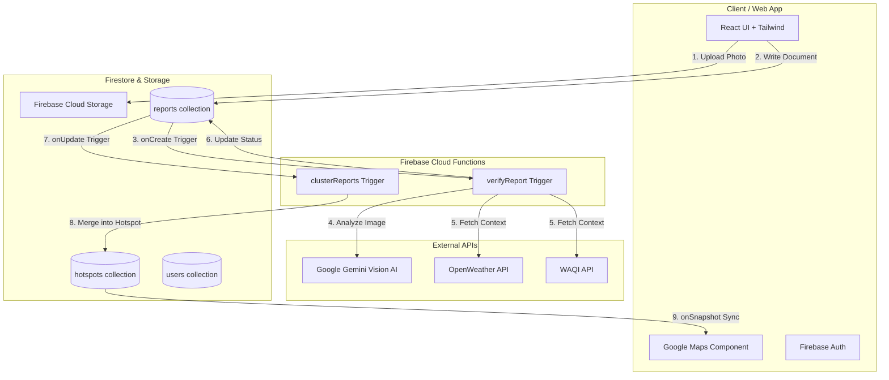

<div align="center">
  
  <h1>AirPatch</h1>
  <p><strong>Clean Air & Clear Streets — Spotting and Fixing Local Pollution Hotspots</strong></p>
  <p>
    <a href="https://airpatch.vercel.app">View Live App</a>
    ·
    <a href="#architecture">View Architecture</a>
  </p>
</div>

<hr />

## 🌍 Overview

**AirPatch** empowers citizens to report localized, visible pollution events (such as open waste burning, construction dust, or industrial smoke) directly from their smartphones using geo-tagged photos. 

Instead of relying solely on broad, city-wide Air Quality Index (AQI) sensors, AirPatch helps pinpoint exact micro-level sources of pollution. Using Google's **Gemini AI**, AirPatch automatically verifies the reports to prevent spam, enriches them with real-time weather and AQI data, and clusters them into **high-priority hotspots** on an actionable dashboard for local authorities.

---

## ✨ Features

### For Citizens (Reporters)
- 📸 **Geo-Tagged Photo Uploads:** Quickly snap and submit photos of visible pollution events.
- 📍 **Automatic Geolocation:** Attaches precise coordinates to your report.
- 🏆 **Gamified Profile & Trust Scores:** Earn points for submitting valid reports and resolving active hotspots.

### For Authorities (Responders)
- 🤖 **AI-Powered Verification:** Gemini automatically analyzes images to filter out irrelevant or fake reports.
- 🗺️ **Real-Time Hotspot Dashboard:** Proximate verified reports are clustered into unified "hotspots" on a live map.
- 🚨 **Heuristic Risk Scoring:** Hotspots receive dynamic risk scores based on density, pollution category, and local weather patterns.
- ✅ **Resolution Workflow:** Quickly view clustered evidence, dispatch teams, and mark hotspots as "Resolved."

---

## 🏗️ Architecture

AirPatch follows a modern, scalable Serverless architecture utilizing **React**, **Vite**, and **Firebase**.



### End-to-End Data Flow
1. **Upload:** A citizen takes a photo, uploads it to Firebase Storage, and writes a `pending` document to the `reports` collection in Firestore.
2. **Verification:** A Cloud Function (`onReportCreated`) intercepts the creation, downloads the image, and asks Gemini to verify if it's a valid pollution event.
3. **Context Enrichment:** If verified, the backend fetches the current wind, temperature, and AQI from OpenWeather and WAQI, appending them to the report.
4. **Clustering:** Another Cloud Function (`assignReportTrigger`) looks at the newly verified report, calculates its distance to active hotspots, and merges it into an existing one (or creates a new one). It also calculates a dynamic risk score.
5. **Real-Time Display:** The React frontend maintains a live subscription to the database. The authority dashboard immediately updates, showing a "NEW" badge on recently updated hotspots.

---

## 💻 Tech Stack

### Frontend
- **React 18** (Vite)
- **TypeScript**
- **Tailwind CSS** (Styling & Animations)
- **Firebase Web SDK** (Auth, Firestore, Storage)
- **Google Maps JavaScript API**
- **React Router**

### Backend
- **Firebase Cloud Functions** (Node.js 20, TypeScript)
- **Google Gemini Pro Vision AI** (Image verification)
- **Firebase Admin SDK**
- **OpenWeather API & WAQI API** (Context Enrichment)

---

## 🚀 Getting Started

### Prerequisites
- Node.js 20+
- Firebase CLI (`npm install -g firebase-tools`)
- A Firebase Project with Firestore (Native Mode), Storage, Auth (Google Provider), and Functions enabled (Blaze Plan).

### 1. Clone the repository
```bash
git clone https://github.com/rishitbanker314-ux/Airpatch.git
cd Airpatch
```

### 2. Environment Variables
#### **Frontend (`web/`)**
Create a `.env.local` file in the `web/` directory based on `web/.env.example`:
```ini
VITE_FIREBASE_API_KEY=your_key
VITE_FIREBASE_AUTH_DOMAIN=your_domain
VITE_FIREBASE_PROJECT_ID=your_project
VITE_FIREBASE_STORAGE_BUCKET=your_bucket
VITE_FIREBASE_MESSAGING_SENDER_ID=your_sender
VITE_FIREBASE_APP_ID=your_app_id
VITE_GOOGLE_MAPS_API_KEY=your_maps_key
```

#### **Backend (`functions/`)**
Firebase Cloud Functions will require these secrets in production (see `functions/.env.example`):
```ini
GEMINI_API_KEY=your_gemini_key
AQI_API_KEY=your_waqi_key
WEATHER_API_KEY=your_openweather_key
```
*(For local development, use a `.env` file in the `functions/` directory).*

### 3. Install Dependencies
```bash
# Install backend dependencies
cd functions && npm install

# Install frontend dependencies
cd ../web && npm install
```

### 4. Run Locally
**Terminal 1 (Backend Emulators):**
*(Requires Java for Firebase Emulators)*
```bash
cd functions
npm run serve
```

**Terminal 2 (Frontend Server):**
```bash
cd web
npm run dev
```
Open `http://localhost:5173` in your browser.

---

## 📂 Repository Structure

- `/web`: React + Vite + TypeScript frontend.
- `/functions`: Firebase Cloud Functions backend.
- `/shared`: Shared TypeScript types and interfaces across frontend and backend.
- `/docs`: Architecture, Firestore Schema, API Contracts, and MVP Specs.
